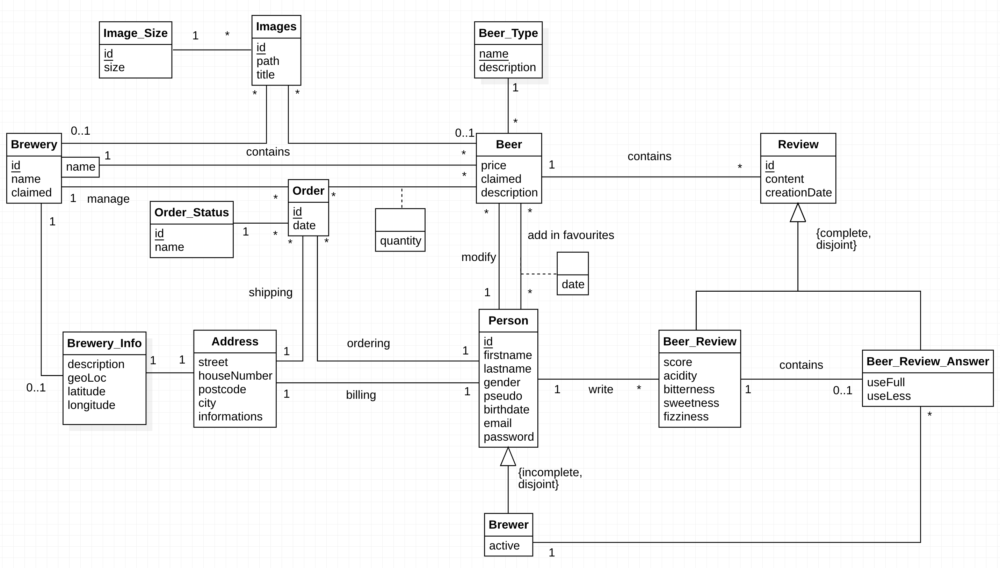

---
title: "Projet BDR : The Beer Garden"
titlepage: true
author: [Erica Akoumba, Olivier D'Ancona, Jean-François Pasche]
date: "26 novembre 2021"
keywords: [BDR]
...

# The Beer Garden : Modélisation conceptuelle

## Table des matières

1. Introduction
2. Modélisation  
  2.1. Schéma EA  
  2.2. Contraintes d'intégrité
3. Choix de conception  
  3.1. Explications complémentaires
  3.2. Remarques sur le cahier des charges
4. Conclusion
5. Annexe : schéma EA grand format

## Introduction

Voici la suite de la modélisation de notre application beergarden. Dans ce document, nous détaillons le fonctionnement de notre application. Premièrement, nous constituons le schéma entité-association qui représentera l'ensemble des types d'entités ainsi que leurs relations. Ensuite, nous expliquerons en quelle mesure notre schéma diffèrera du cahier des charges. Finalement, nous listerons les contraintes d'intégrité inhérentes à notre modélisation.

## Modélisation

### Schéma EA

### Contraintes d'intégrité

#### Person
- La date de naissance doit correspondre à un âge de plus de 18 ans.

#### Beer
- Le prix doit être supérieur ou égal à 0 lorsqu'il est défini

#### Review
- La date de création doit être inférieure à la date actuelle.
- La date de création doit être supérieure à la date de création d'une bière.

#### Beer_Review
- Le score doit être compris entre 2 et 10.
- L'acidité, l'amertume, la douceur et la pétillance ont des valeurs comprises entre 1 et 10.

#### Beer_Review_Answer
- `useFull` et `useLess` doivent être supérieurs ou égals à 0.
- Une réponse à un avis ne peut pas avoir une date inférieure à l'avis concerné.
- Seuls les brasseurs actifs peuvent donner une réponse.

#### Beer - Person (favoris)
- La date d'ajout dans les favoris doit être inférieure à la date actuelle.
- La date d'ajout dans les favoris doit être supérieure à la date de création de la bière.

#### Beer - Order
- La quantité doit être supérieure à 0.
- La date de création de bière doit être égale ou inférieure à la date actuelle.

#### Brewery
- Le nom de la brasserie doit être unique.
- Un brasseur ne peut pas revendiquer une brasserie déjà revendiquée.

#### Address
- Le numéro de rue doit être supérieur à 0.
- Le numéro postal doit être supérieur à 0.

#### Order
- La date de commande doit être inférieur ou égale la date actuelle.
- La date de commande doit être supérieure à la date de création de la bière.

#### Brewery_Infos
- Les valeurs de longitude et de latitude sont comprises dans l'intervalle [-180, 180].

## Choix de conception

### Explications complémentaires

#### Brewery

- `claimed` est un champ booléen. `false` signifie que la brasserie n'a pas été revendiquée.
- Lorsqu'un brasseur revendique une brasserie, les droits de modification des bières de cette brasserie lui sont transférés par une modification de la relation `modify` entre `Person` et `Beer`. Le champ `claimed` de l'entité `Brewery` passe à true.

### Remarques sur le cahier des charges

Quelques adaptations ont du être faites par rapport au cahier des charges. La possibilité de supprimer un compte a été remplacée par la possibilité de désactiver un compte. Cela évitera la suppression des commentaires d'un client qui supprimerait son compte.
En revanche, un brasseur peut supprimer les informations contenues dans `BreweryInfos` sans que cela n'affecte les commandes passées dans une brasserie, car celles-ci sont liées à l'entité `Brewery`, dont les instances ne pourront pas être supprimées.  
Enfin, le rôle d'administrateur a été retiré, car il n'apporte pas grand chose du point de vue de la base de donnée mais demanderait beacoup de travail du point de vue de l'interface utilisateur.

## Conclusion

La création du modèle EA nous a mené à remettre en cause certains aspects du cahier des charges, plus précisément la manière de supprimer un compte. A ce stade, la question se pose de séparer l'entité `Person` en deux entités `Person` et `PersonInfos`, avec dans la première le pseudonyme et le mot de passe et dans la seconde toutes les autres informations. Cela permettrait de lier `Person` à `Order`, `Beer_Review`, `Beer` et non `PersonInfos`. Ainsi, on pourrait supprimer les informations personnelles d'un utilisateur sans affecter ses relations avec les différentes entités. A voir si la solution proposée est pertinente.
