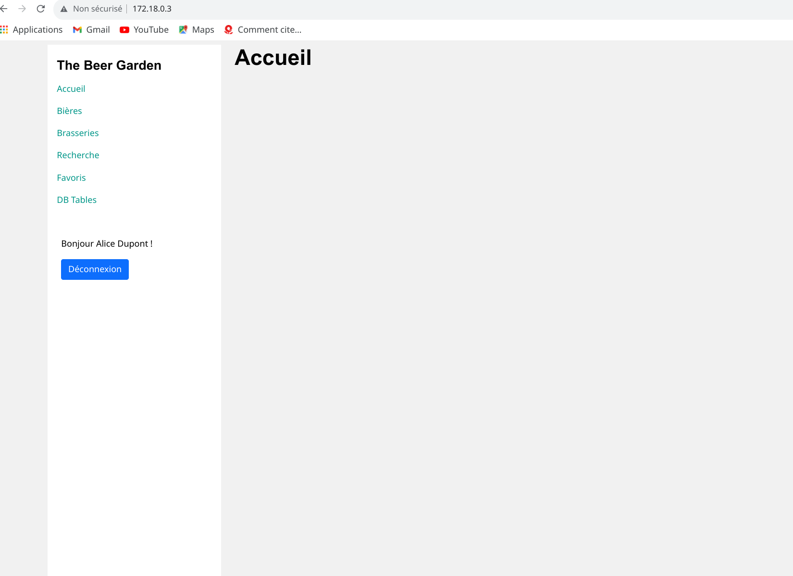
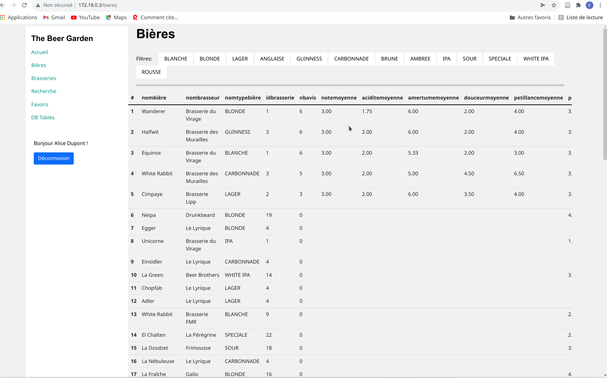
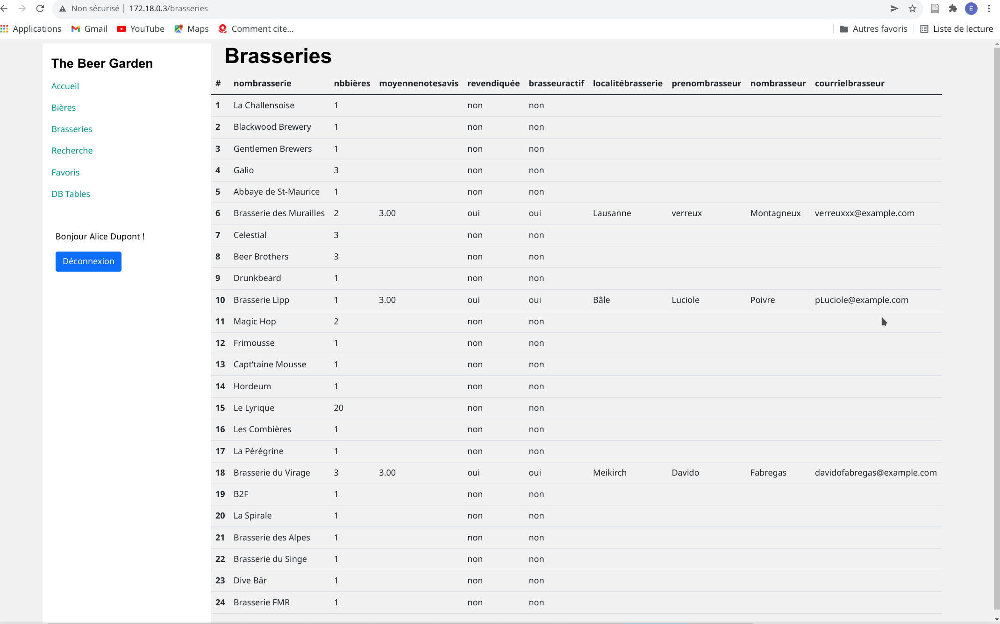
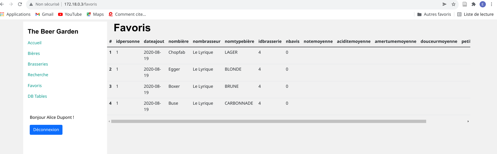
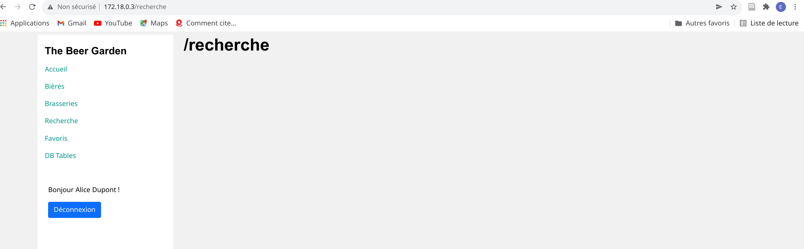
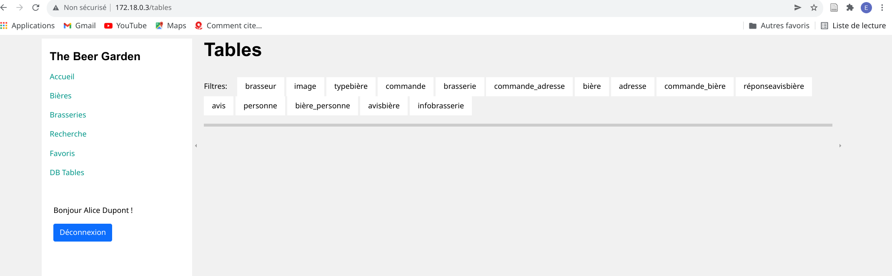

---
title: "Projet BDR : The Beer Garden"
titlepage: true
author: [Erica Akoumba, Olivier D'Ancona, Jean-François Pasche]
date: "27 Janvier 2022"
keywords: [BDR]
...

## Table des matières

1.  Table des matières
2.  Introduction
3.  Descriptif du projet réalisé
4.  Modèle entité association
5.  Modèle relationnel
    -   Représentation graphique
    -   Description des tables / attributs
6.  Description de l'application réalisée
    -   interface
    -   manuel utilisateur
7.  Bugs connus
8.  Conclusion
9.  Annexes
    -   Guide d'installation
    -   Structure du projet

## Introduction

Ce projet a été suivi par le Pr. Rentsch dans le cadre du cours sur les bases de données relationnelles donné en 2021-2022 à l'HEIG-VD. Ce document constitue la clé de voute du projet qui regroupe une vue globale sur le projet et les précédantes étapes. Voici la liste de ce qui a été entrepris préalablement:

-   Cahier des charges
-   Modélisation conceptuelle (schéma EA)
-   Modèle relationnel (script SQL peuplement + structure de la bdd)
-   Requêtes, vues, triggers et procédures stockées
-   Réalisation d'une application permettant d'interagir avec la base de donnée

## Descriptif du projet réalisé

L'application est un site web réalisé avec php et bootstrap valorisant tout ce qui touche à la bière. Cette ébauche mettra en relation des amateurs et amatrices et des professionnels de la bière artisanale. Ils et elle pourront ainsi partager leurs avis respectifs sur différentes bières Le site comporte plusieurs rubriques:

1. **Bière** : une page qui permet d'afficher tous les détails d'une bière. A noter qu'une description de bière n'est pas la même chose qu'un avis laissé par un utilisateur. C'est un texte qui explique comment le brasseur conçoit son propre produit.

2. **Catalogue des bières** : page qui référence toutes les bières avec une barre de recherche.  
2.1 Les premières bières visibles sont choisies aléatoirement parmi toutes les bières

3. **Catalogue des brasseries** : page qui référence toutes les brasseries avec une barre de recherche.

4. **Brasserie** : c'est une page qui référence des bières ainsi que les détails de l'établissement.

5. **Bières favorites** : une page qui contient les bières favorites de l'utilisateur connecté

6. **Recherche avancée** : page qui permet de faire une recherche multicritère

7. **Enregistrer une nouvelle bière** : page qui permet d'ajouter une bière au catalogue global.

Lorsqu'on clique sur Bières, toutes les bières sont présentées à l'utilisateur.

Lorsqu'on clique sur Brasseries, toutes les Brasseries sont présentées à l'utilisateur.

Dans l'onglet favoris, l'utilisateur peut voir toutes les bières qu'il a ajouté à ses favoris

L'onglet recherche n'a pas encore été implémenté

L'onglet DBtables donne à l'utilisateur un accès plus rapide aux informations qu'il pourrait souhaiter obtenir. Par exemple en cliquant sur DBtables

Sur ce onglet, en cliquant sur BrasseriesInfo l'utilisateur accède aisément aux informations de la brasserie.

## Modèle entité association

Le modèle EA ci dessus est le modèle EA final de notre projet. Par rapport au dernier modèle fournit, un lien entre le brasseur et sa brasserie a été ajouté, ce qui a induit à la suppression de l'attribut revendiquée. Une brasserie possédant un idBrasseur NOT NULL sera considérée comme non revendiquée.

## Modèle relationnel

### Représentation graphique

### Description des tables / attributs

Pour une meilleure compréhension du modèle ci dessus, nous allons décrire les tables et les attributs qu'elles comportent.

#### Personne

Elle nous permet de représenter les acteurs de notre système. Elle comporte les informations dont nous souhaitons disposer pour chaque acteur du système: Le prénom, le nom , le genre, le pseudo, la date de naissance le courriel, le mot de passe et l'adresse. L'adresse ici est une information importante car notre application offre la possibilité de passer des commandes de bières. Et dans certains cas, l'adresse de livraison pourra être l'adresse renseignée lors de la création du compte utilisateur.

#### Brasseur

Le brasseur est un acteur du système qui hérite de d'une **Personne** avec pour attribut complémentaire **actif** qui sera à **true** quand le brasseur en question sera actif dans la base de donnée.

#### Image

C'est un table qui permet de stocker les informations basiques sur les images des **Brasseries** et des **Bières** que la BD va stocker. ainsi les tables ``

## Conclusion

La fin du semestre est déjà arrivée et nous avons eu du plaisir à développer une application complète centrée sur la partie base de donnée. Nous avons discuté avec soin des modalités de conception afin de créer une base de donnée utilisable et intéressante du point de vue fonctionnelle. Dans ce projet, nous étions à la fois le mendant et le développeur. Ce qui apporte une grande flexibilité face aux choix de conception ou aux rectifications de modélisation nécessaires. Il a été difficile de tenir le cahier des charges vu l'ampleur de la tâche mais nous sommes fières de vous présenter notre application. La quantité de travail qui a été fournie sur ce projet durant un semestre autant chargé est simplement fantastique. Au final, même si notre cahier des charges diffère de celui initial, nous avons beaucoup appris de ce projet. Il nous a appris à jongler avec les différentes notions du modèle relationnel, de créer des vues intéressantes pour le côté utilisateur etc... Malgré tout, la quantité de travail nécessaire à rendre pour l'application est hors du cadre du cours. Pour cette raison. nous avons placé l'emphase sur la conception, le schéma ainsi que le script de peuplement.

## Bugs connus

## Annexes

-   [Guide Installation](5_Guide_Installation.pdf)
-   [Manuel Utilisateur](5_Manuel_Utilisateur.pdf)
