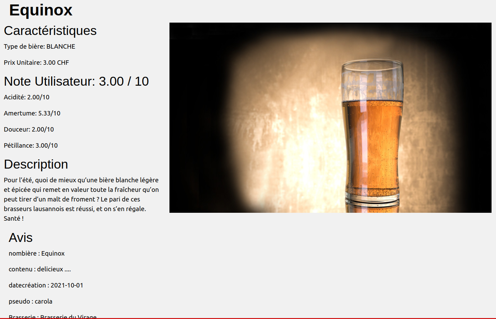
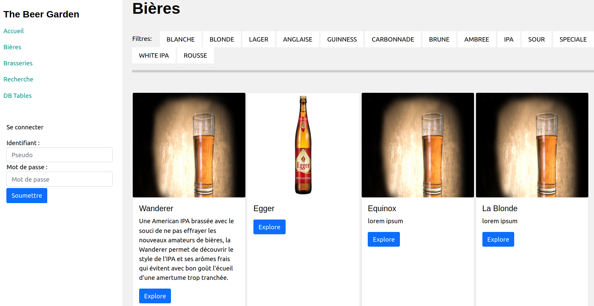
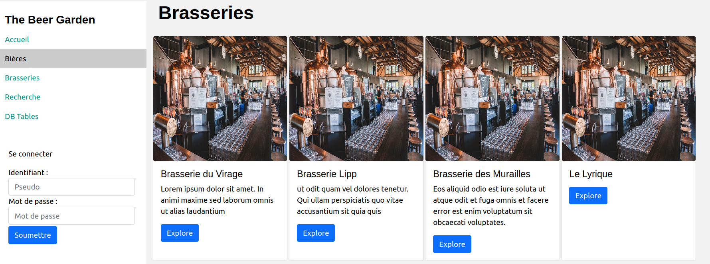
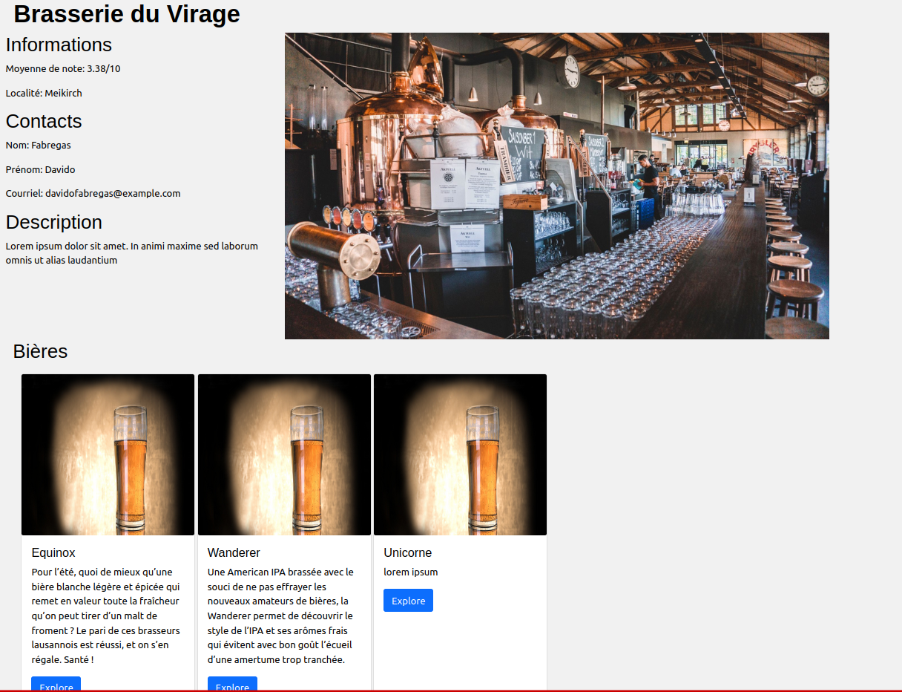
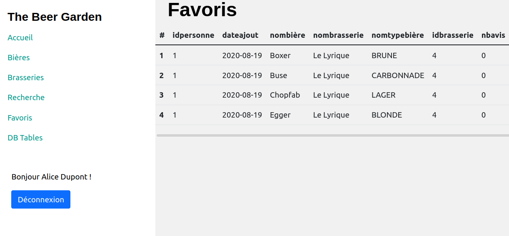
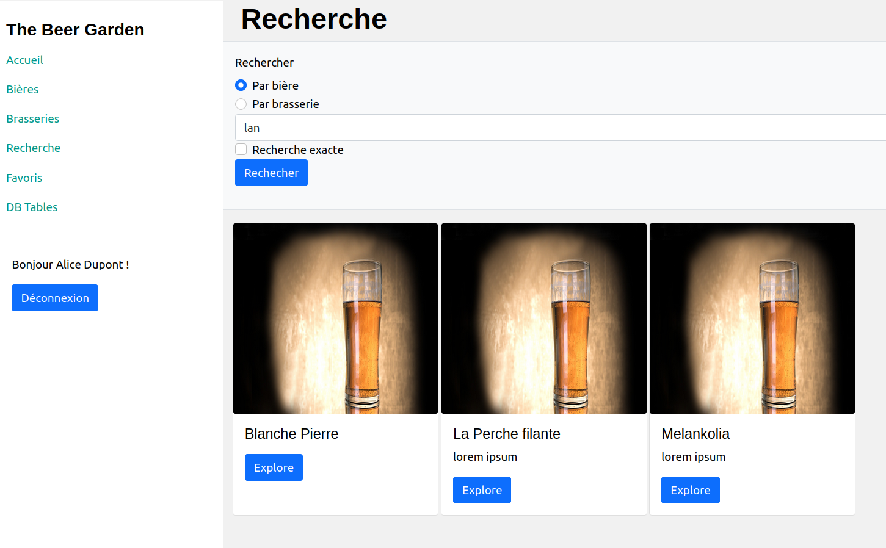
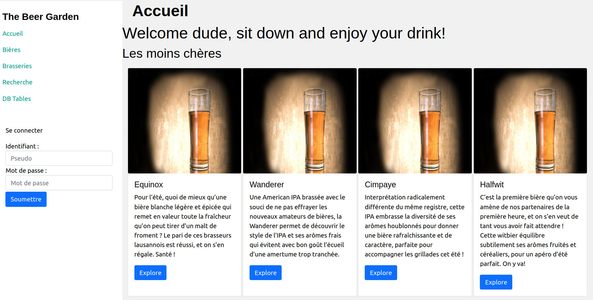
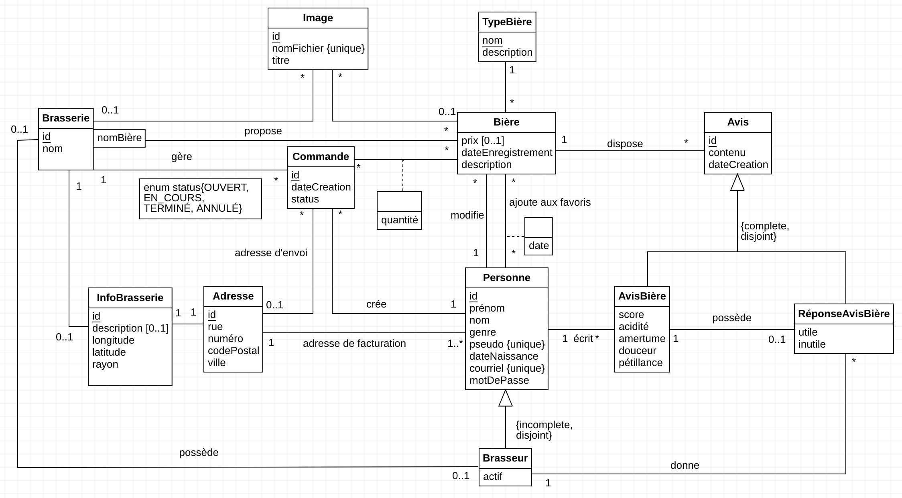
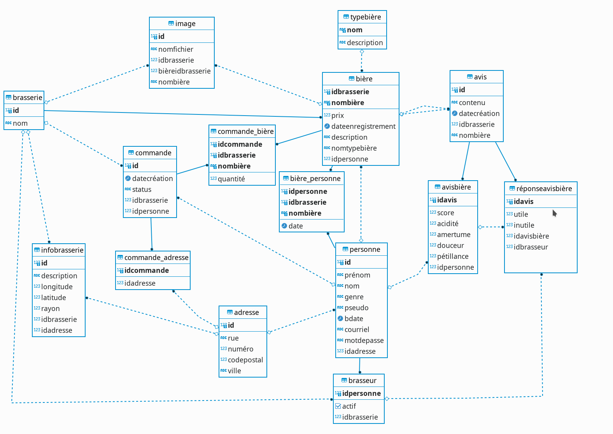

---
title: "Projet BDR : The Beer Garden"
titlepage: true
author: [Erica Akoumba, Olivier D'Ancona, Jean-François Pasche]
date: "27 Janvier 2022"
keywords: [BDR]
...

## Table des matières

1.  Table des matières
2.  Introduction
3.  Descriptif du projet réalisé
4.  Modèle entité association
5.  Modèle relationnel
    -   Représentation graphique
    -   Description des tables / attributs
6.  Description de l'application réalisée
    -   interface
    -   manuel utilisateur
7.  Bugs connus
8.  Conclusion
9.  Annexes
    -   Guide d'installation
    -   Structure du projet

## Introduction

Ce projet a été suivi par le Pr. Rentsch dans le cadre du cours sur les bases de données relationnelles du semetre d'automne de l'année académique 2021-2022 à l'HEIG-VD. Ce document présente le projet tel qu'il se présentait pour le rendu final. Il offre une vue générale  sur le projet, sur ce qui a été réalisé ou non réalisé, avec un accent particulier sur la structure des données. Voici la liste de ce qui a été entrepris préalablement:

-   Cahier des charges
-   Modélisation conceptuelle (schéma EA)
-   Modèle relationnel (script SQL peuplement + structure de la bdd)
-   Requêtes, vues, triggers et procédures stockées
-   Réalisation d'une application permettant d'interagir avec la base de donnée

## Descriptif du projet réalisé

L'application est un site web réalisé avec php et bootstrap valorisant la bière en tant que boisson proposée aux consommateurs. Le but premier est d'offrir aux amateurs de bières une base de données de bières, d'avis sur des bières et de brasserie afin de lui permettre de faire des découvertes. L'idée était aussi de permettre l'ajout de nouvelles bières et de nouveaux avis, mais toute la partie insertion n'a pas été réalisée. Du point de vue du producteur de bière, le but était d'offrir la possibilité de répondre aux avis postés sur ses bières, ainsi que celle de décrire ses produits et sa brasserie.
Un dernier pan de l'application devait être de permettre le passage de commande de bières auprès des brasseurs, mais cela non plus n'a pas pu être réalisé.
Cependant, tout est en place au niveau de la base de donnée (tables, triggers, procédures, vues) pour permettre la mise en place de ces interactions et mettre en relation des amateurs et amatrices et des professionnels de la bière artisanale. Ils et elle pourront ainsi partager leurs avis respectifs sur différentes bières.
En l'état, le site comporte les rubriques suivantes :

1. **Bière** : une page qui permet d'afficher tous les détails d'une bière. C'est un onglet qui explique comment le brasseur conçoit son propre produit.

2. **Catalogue des bières** : page qui référence toutes les bières.

3. **Catalogue des brasseries** : page qui référence toutes les brasseries.

4. **Brasserie** : c'est une page qui référence des bières ainsi que les détails de l'établissement.

5. **Bières favorites** : une page qui contient les bières favorites de l'utilisateur connecté.

6. **Recherche** : page qui permet de faire une recherche par nom

7. **Page Accueil**: donne un aperçu des meilleures bières.

8. **Enregistrer une nouvelle bière** : page qui permet d'ajouter une bière au catalogue global.

## Modèle entité association

Par rapport au modèle fourni dans le dernier rapport, un lien omis entre le brasseur et sa brasserie a été ajouté. Ce qui a entraîné la suppression de l'attribut **revendiqué**. Une brasserie possédant un **idBrasseur** NOT NULL sera considérée comme non revendiquée.

## Modèle relationnel

### Représentation graphique

Ce schéma a été réalisé avec dBeaver et représente notre base de donnée en l'état, avec toutes ses relations, leurs attributs et leurs clefs, ainsi que les liens elles.

### Description des tables / attributs

Pour une meilleure compréhension du modèle ci dessus, nous allons décrire les tables et les attributs qu'elles comportent.

#### Personne

Une personne est identifiée par son id. Elle nous permet de représenter les acteurs de notre système. Elle comporte les informations dont nous souhaitons disposer pour chaque acteur du système: Le prénom, le nom , le genre, le pseudo, la date de naissance le courriel, le mot de passe et l'adresse. L'adresse ici est une information importante car notre application offre la possibilité de passer des commandes de bières. Dans le cas d'une commande, l'adresse de livraison par défaut sera l'adresse référencée dans la table Personne et sera aussi l'adresse de facturation.

#### Brasseur

Le brasseur est un acteur du système qui hérite d'une **Personne** avec pour attribut complémentaire **actif** qui est à **true** si le brasseur est en activité. Un brasseur est obligatoirement en relation avec une brasserie (sa brasserie donc). Si un brasseur cesse son activité, il peut désactiver son compte, sans que les informations qui lui sont liées (réponses à des avis, commandes, bières) ne soient affectées. Un brasseur inactif ne peut plus répondre à un avis. En outre, il n'est plus possible de lui passer des commandes de bières.

#### Bière
Une bière est identifiée par son nom et par l'id de la brasserie dont elle provient. Elle a obligatoirement une date de craéation. Elle peut avoir un prix.
#### Image

Cette table permet de stocker les noms de fichiers des images liées soit à une brasserie, soit à une bière. Une brasserie ou une bière peut être en relation avec plusieurs images.

## Conclusion

La fin du semestre est déjà arrivée et nous avons eu du plaisir à développer une application complète centrée sur la partie base de donnée. Nous avons discuté avec soin des modalités de conception afin de créer une base de donnée utilisable et intéressante du point de vue fonctionnelle. Dans ce projet, nous étions à la fois le mendant et le développeur. Ce qui apporte une grande flexibilité face aux choix de conception ou aux rectifications de modélisation nécessaires. Il a été difficile de tenir le cahier des charges vu l'ampleur de la tâche mais nous sommes fières de vous présenter notre application. La quantité de travail qui a été fournie sur ce projet durant un semestre autant chargé est simplement fantastique. Au final, même si notre cahier des charges diffère de celui initial, nous avons beaucoup appris de ce projet. Il nous a appris à jongler avec les différentes notions du modèle relationnel, de créer des vues intéressantes pour le côté utilisateur etc... Malgré tout, la quantité de travail nécessaire à rendre pour l'application est hors du cadre du cours. Pour cette raison. nous avons placé l'emphase sur la conception, le schéma ainsi que le script de peuplement.

## Bugs connus

## Annexes

-   [Guide Installation](4_Guide_Installation.pdf)
-   [Manuel Utilisateur](4_Manuel_Utilisateur.pdf)
