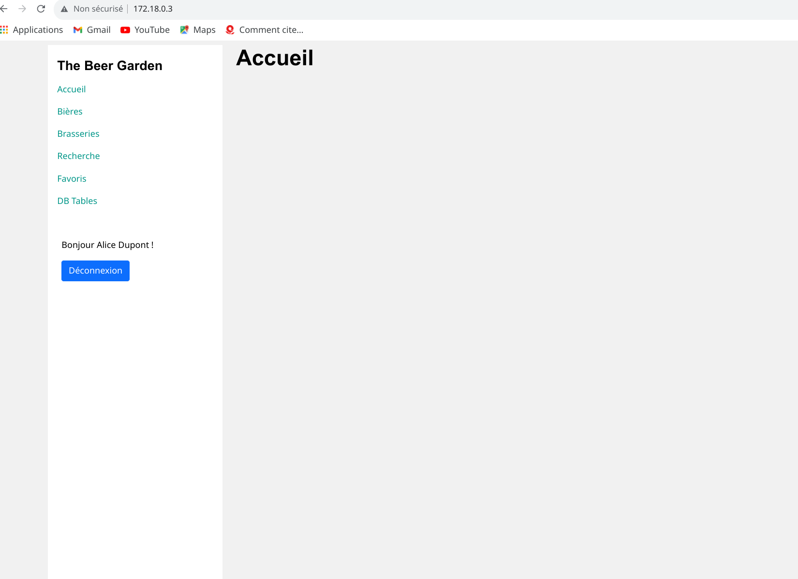
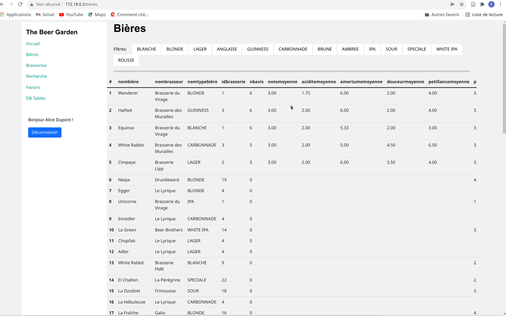
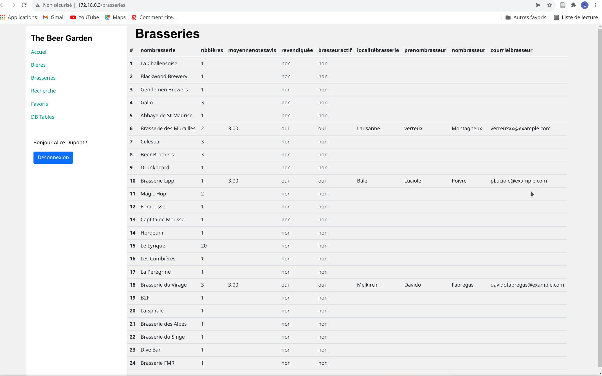
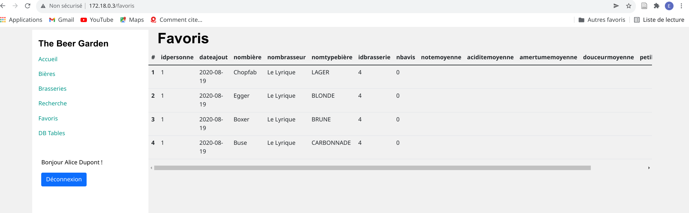
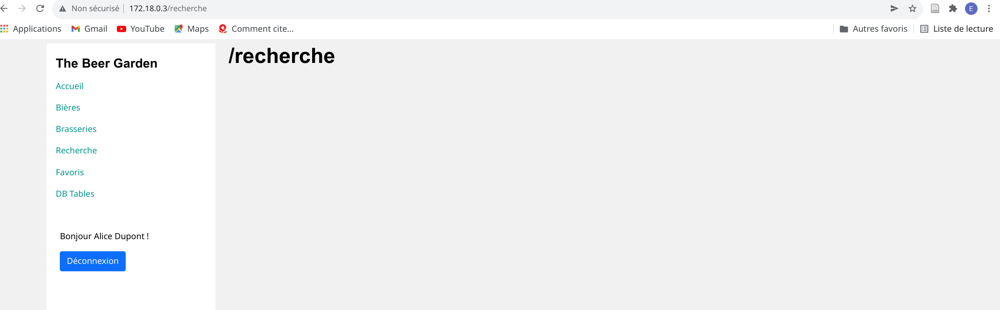
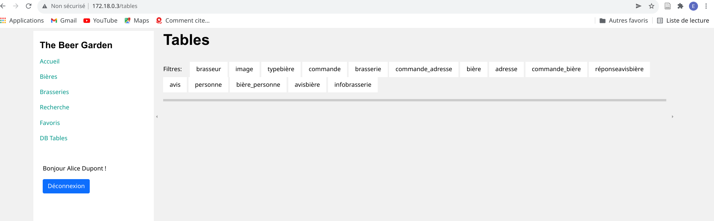
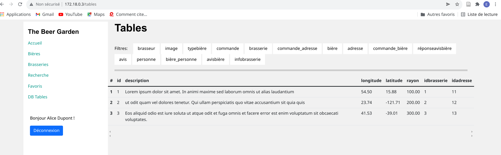

* * *

title: "Projet BDR : The Beer Garden"
titlepage: true
author: [Erica Akoumba, Olivier D'Ancona, Jean-François Pasche]
date: "27 Janvier 2022"
keywords: [BDR]
...

## Table des matières

1.  Table des matières
2.  Introduction
3.  Descriptif du projet réalisé
4.  Modèle entité association
5.  Modèle relationnel
    -   Représentation graphique
    -   Description des tables / attributs
6.  Description de l'application réalisée
    -   interface
    -   manuel utilisateur
7.  Bugs connus
8.  Conclusion
9.  Annexes
    -   Guide d'installation
    -   Structure du projet

## Introduction

Ce projet a été suivi par le Pr. Rentsch dans le cadre du cours sur les bases de données relationnelles donné en 2021-2022 à l'HEIG-VD. Ce document constitue la clé de voute du projet qui regroupe une vue globale sur le projet et les précédantes étapes. Voici la liste de ce qui a été entrepris préalablement:

-   Cahier des charges
-   Modélisation conceptuelle (schéma EA)
-   Modèle relationnel (script SQL peuplement + structure de la bdd)
-   Requêtes, vues, triggers et procédures stockées
-   Réalisation d'une application permettant d'interagir avec la base de donnée

## Descriptif du projet réalisé

Après connexion avec les identifiants pseudo:Alicow mot de passe: 1234 de l'utilisateur Alice Dupont.

Lorsqu'on clique sur Bières, toutes les bières sont présentées à l'utilisateur.

Lorsqu'on clique sur Brasseries, toutes les Brasseries sont présentées à l'utilisateur.

Dans l'onglet favoris, l'utilisateur peut voir toutes les bières qu'il a ajouté à ses favoris

L'onglet recherche n'a pas encore été implémenté

L'onglet DBtables donne à l'utilisateur un accès plus rapide aux informations qu'il pourrait souhaiter obtenir. Par exemple en cliquant sur DBtables

Sur ce onglet, en cliquant sur BrasseriesInfo l'utilisateur accède aisément aux informations de la brasserie.

## Structure du projet

## Modèle entité association

Le modèle EA ci dessus est le modèle EA final de notre projet. Par rapport au dernier modèle fournit, un lien entre le brasseur et sa brasserie a été ajouté, ce qui a induit à la suppression de l'attribut revendiquée. Une brasserie possédant un idBrasseur NOT NULL sera considérée comme non revendiquée.

## Modèle relationnel

### Représentation graphique

### Description des tables / attributs

Pour une meilleure compréhension du modèle ci dessus, nous allons décrire les tables et les attributs qu'elles comportent.

#### Personne

Elle nous permet de représenter les acteurs de notre système. Elle comporte les informations dont nous souhaitons disposer pour chaque acteur du système: Le prénom, le nom , le genre, le pseudo, la date de naissance le courriel, le mot de passe et l'adresse. L'adresse ici est une information importante car notre application offre la possibilité de passer des commandes de bières. Et dans certains cas, l'adresse de livraison pourra être l'adresse renseignée lors de la création du compte utilisateur.

#### Brasseur

Le brasseur est un acteur du système qui hérite de d'une `Personne` avec pour attribut complémentaire `actif` qui sera à `true` quand le brasseur en question sera actif dans la base de donnée.

#### Image

C'est un table qui permet de stocker les informations basiques sur les images des `Brasseries` et des `Bières` que la BD va stocker. ainsi les tables ``

## Mise en route

## Conclusion

## Bugs connus

## Annexes

-   [Guide Installation](5_Guide_Installation.md)
