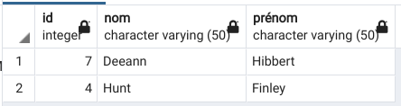
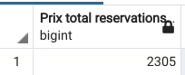

# BDR : Laboratoire no 2

## Introduction

Pour ce laboratoire, nous avions comme donnée un schéma entité-association d'une base de donnée ainsi que le script permettant de la créer et de remplir ses tables. Nous avions ensuite 15 requêtes à effectuer dessus. Le but de ce travail était plus exactement de pratiquer les requêtes `SELECT`. Ce rapport présente les requêtes que nous avons écrites ainsi que des captures d'écran des résultats obtenus. Nous retranscrivons avant chaque requête ce qui était textuellement demandé.

## Résultats

### 1. Les clients ayant fait au moins une réservation dans un hôtel se trouvant dans la ville dans laquelle ils habitent.

```SQL
SELECT
  DISTINCT Client.id AS "Id Client",
  Client.nom AS "Nom Client",
  Client.prénom AS "Prénom Client"
FROM
  Client
  INNER JOIN Réservation ON Réservation.idClient = Client.id
  INNER JOIN Hôtel ON Réservation.idChambre = Hôtel.id
WHERE
  Client.idVille = Hôtel.idVille;
```


### 2. Le prix minimum et le prix maximum pour passer une nuit dans une chambre d'hôtel dans la ville d'Interlaken.

```SQL
SELECT
  MIN(prixParNuit) AS "Prix Minimum",
  MAX(prixParNuit) AS "Prix Maximum"
FROM
  Chambre
  INNER JOIN Hôtel ON Chambre.idHôtel = Hôtel.id
  INNER JOIN Ville ON Hôtel.idVille = Ville.id
WHERE
  Ville.nom = 'Interlaken';
```


### 3. Pour l'hôtel "JungFrau Petrus Palace", lister le prix moyen des chambres par étage. Classer les résultats par ordre croissant du prix moyen.

```SQL
SELECT
  Hôtel.nom AS "Nom Hôtel",
  étage,
  ROUND(AVG(prixparnuit), 2) AS "Prix moyen par étage"
FROM
  chambre
  INNER JOIN hôtel ON chambre.idhôtel = hôtel.id
WHERE
  hôtel.nom = 'JungFrau Petrus Palace'
GROUP BY
  Chambre.étage,
  Hôtel.nom
ORDER BY
  "Prix moyen par étage";
```


### 4. Les hôtels proposant au moins une chambre disposant de plus d'une baignoire.

```SQL
SELECT
  DISTINCT Hôtel.nom AS "Hôtel ayant plus d'une baignoire dans une chambre"
FROM
  Hôtel
  INNER JOIN Chambre_Equipement ON Hôtel.id = Chambre_Equipement.idChambre
WHERE
  Chambre_Equipement.nomEquipement = 'Baignoire'
  AND Chambre_Equipement.quantité > 1;
```

<<<<<<< HEAD


=======
>>>>>>> f8bf0a9586be60ec490a221f4c001ac24a51593d
### 5. L'hôtel qui a le plus de tarifs de chambres différents.

```SQL
WITH tarifHôtel AS (
  SELECT
    Hôtel.nom AS "Nom Hôtel",
    COUNT(DISTINCT Chambre.prixParNuit) AS "nbtarif"
  FROM
    Chambre
    INNER JOIN Hôtel ON Hôtel.id = Chambre.idHôtel
  GROUP BY
    Hôtel.nom
)
SELECT *
FROM
  tarifHôtel
ORDER BY
  tarifHôtel.nbtarif DESC
LIMIT
  1;
```


### 6. Les clients ayant réservé plus d'une fois la même chambre. Indiquer les clients et les chambres concernées.

```SQL
SELECT
  Client.id AS "Id Client",
  Client.nom AS "Nom Client",
  Client.prénom AS "Prénom Client",
  Hôtel.nom AS "Nom Hôtel",
  Réservation.numéroChambre AS "Numéro Chambre"
FROM
  Client
  INNER JOIN Réservation ON Client.id = Réservation.idClient
  INNER JOIN Hôtel ON Réservation.idChambre = Hôtel.id
GROUP BY
  Client.id,
  Réservation.numéroChambre,
  Hôtel.id
HAVING
  COUNT(*) > 1;
```

<<<<<<< HEAD


=======
>>>>>>> f8bf0a9586be60ec490a221f4c001ac24a51593d
### 7. Les membres de l'hôtel "Kurz Alpinhotel" qui n'ont fait aucune réservation depuis qu'ils en sont devenus membre.

```SQL
WITH MembresAlpine AS(
  SELECT
    DISTINCT Client.id AS id,
    Client.nom AS nom,
    Client.prénom AS prénom,
    Membre.depuis AS membreDepuis,
    Membre.idHôtel AS idHôtel
  FROM
    Membre
    INNER JOIN Hôtel ON Membre.idHôtel = Hôtel.id
    INNER JOIN CLient ON Membre.idClient = Client.id
  WHERE
    Hôtel.nom = 'Kurz Alpinhotel'
)
SELECT
  MembresAlpine.id,
  MembresAlpine.nom,
  MembresAlpine.prénom
FROM
  MembresAlpine
EXCEPT
SELECT
  MembresAlpine.id,
  MembresAlpine.nom,
  MembresAlpine.prénom
FROM
  MembresAlpine
  INNER JOIN Réservation ON (MembresAlpine.id, MembresAlpine.idHôtel) = (Réservation.idClient, Réservation.idChambre)
WHERE
  Réservation.dateRéservation >= MembresAlpine.membreDepuis;
```


### 8. Les villes, classées dans l'ordre décroissant de leur capacité d'accueil totale (nombre de places des lits de leurs hôtels).

```SQL
SELECT
  Ville.nom AS "Villes",
  SUM(Lit.nbPlaces * Chambre_Equipement.quantité) AS "Capacité accueil"
FROM
  Ville
  INNER JOIN Hôtel ON Ville.id = Hôtel.idVille
  INNER JOIN Chambre_Equipement ON Hôtel.id = Chambre_Equipement.idChambre
  INNER JOIN Lit ON Chambre_Equipement.nomEquipement = Lit.nomEquipement
GROUP BY
  Ville.nom
ORDER BY
  SUM(Lit.nbPlaces * Chambre_Equipement.quantité) DESC;
```


### 9. Les villes dans lesquelles ont été faites le plus grand nombre de réservations.

```SQL
WITH nbSéjourParVille AS (
  SELECT
    Hôtel.idVille,
    COUNT(Hôtel.idVille) AS nbSéjour
  FROM
    Hôtel
    INNER JOIN Réservation ON Hôtel.id = Réservation.idChambre
  GROUP BY
    Hôtel.idVille
)
SELECT
  Ville.nom AS "Ville",
  nbSéjourParVille.nbSéjour
FROM
  Ville
  INNER JOIN nbSéjourParVille ON Ville.id = nbSéjourParVille.idVille
WHERE
  nbSéjourParVille.nbSéjour >= ALL (
    SELECT
      DISTINCT nbSéjourParVille.nbSéjour
    FROM
      nbSéjourParVille
  );
```


### 10. Les chambres réservées pour la nuit du 24 décembre (de cette année).

```SQL
WITH CurrentYear AS (
  SELECT
    *
  FROM
    MAKE_DATE(EXTRACT(YEARFROMCURRENT_DATE):: SMALLINT,12,24) AS christmas
)
SELECT
  DISTINCT Hôtel.nom AS "Nom Hôtel",
  Chambre.Numéro
FROM
  Chambre
  INNER JOIN Hôtel ON Chambre.idHôtel = Hôtel.id
  INNER JOIN Réservation ON Réservation.idChambre = Chambre.idHôtel
  AND Réservation.numéroChambre = Chambre.numéro
WHERE
  Réservation.dateArrivée <= (
    SELECT
      christmas
    FROM
      CurrentYear
  )
  AND Réservation.dateArrivée + Réservation.nbNuits >= (
    SELECT
      christmas
    FROM
      CurrentYear
  )
```


### 11. Les réservations faites dans des chambres qui ont un nombre de lits supérieur au nombre de personnes de la réservation.

```SQL
SELECT
  Réservation.idClient AS "Id Client",
  Client.nom AS "Nom Client",
  Client.prénom AS "Prénom Client",
  Hôtel.nom AS "Nom Hôtel",
  Réservation.numéroChambre AS "Numéro Chambre",
  TO_CHAR(Réservation.dateRéservation, 'DD/MM/YYYY') AS "Date Réservation",
  TO_CHAR(Réservation.dateArrivée, 'DD/MM/YYYY') AS "Date Arrivée",
  Réservation.nbNuits,
  Réservation.nbPersonnes
FROM
  Réservation
  INNER JOIN CLient ON Réservation.idClient = Client.id
  INNER JOIN Hôtel ON Réservation.idChambre = Hôtel.id
  INNER JOIN Chambre_Equipement ON Réservation.numéroChambre = Chambre_Equipement.numéroChambre
  AND Réservation.idChambre = Chambre_Equipement.idChambre
  INNER JOIN Lit ON Chambre_Equipement.nomEquipement = Lit.nomEquipement
GROUP BY
  réservation.idclient,
  Client.nom,
  Client.prénom,
  Hôtel.nom,
  réservation.numérochambre,
  réservation.dateréservation,
  réservation.datearrivée,
  Réservation.nbNuits,
  Réservation.nbPersonnes
HAVING
  SUM(Chambre_Equipement.quantité) > Réservation.nbPersonnes;
```


### 12. Les hôtels dont pas toutes les chambres sont équipées d'une TV. N'utiliser ni EXCEPT, ni INTERSECT.

```SQL
SELECT
  Hôtel.nom AS "Hôtels avec chambres sans TV"
FROM
  Hôtel
  INNER JOIN Chambre ON Chambre.idHôtel = Hôtel.id
WHERE
  (Chambre.idHôtel, Chambre.numéro) NOT IN (
    SELECT
      Chambre_Equipement.idChambre,
      Chambre_Equipement.numéroChambre
    FROM
      Chambre_Equipement
    WHERE
      Chambre_Equipement.nomEquipement = 'TV'
  )
GROUP BY
  Hôtel.nom;
```


### 13. Les chambres à Lausanne ayant au moins une TV et un lit à 2 places.

```SQL
  WITH ChambresLausanne AS (
    SELECT
      Hôtel.nom AS nomHôtel,
      Chambre_Equipement.numéroChambre AS numéroChambre,
      Chambre_Equipement.nomEquipement AS nomEquipement,
      Chambre_Equipement.quantité AS quantitéEuipement,
      Lit.nbPlaces AS nbPlacesLit
    FROM
      Hôtel
      INNER JOIN Ville ON Ville.id = Hôtel.idVille
      INNER JOIN Chambre_Equipement ON Chambre_Equipement.idChambre = Hôtel.id
      LEFT JOIN Lit ON Lit.nomEquipement = Chambre_Equipement.nomEquipement
    WHERE
      Ville.nom = 'Lausanne'
  )
SELECT
  ChambresLausanne.nomHôtel AS "Nom Hôtel",
  ChambresLausanne.numéroChambre AS "Numéro Chambre"
FROM
  ChambresLausanne
WHERE
  ChambresLausanne.nomEquipement = 'TV'
  AND ChambresLausanne.quantitéEuipement >= 1
  AND ChambresLausanne.numéroChambre IN (
    SELECT
      ChambresLausanne.numéroChambre
    FROM
      ChambresLausanne
    WHERE
      ChambresLausanne.nbPlacesLit = 2
      AND ChambresLausanne.quantitéEuipement >= 1
  );
```


### 14. Pour l'hôtel "Hôtel Royal", lister toutes les réservations en indiquant de combien de jours elles ont été faites à l'avance (avant la date d'arrivée) ainsi que si la réservation a été faite en tant que membre de l'hôtel. Trier les résultats par ordre des réservations (en 1 er celles faites le plus à l’avance), puis par clients (ordre croissant du nom puis du prénom).

```SQL
WITH clientRoyal AS (
  SELECT
    DISTINCT Réservation.*
  FROM
    Réservation
    INNER JOIN Hôtel ON Hôtel.id = Réservation.idChambre
    INNER JOIN Membre ON Membre.idClient = Réservation.idClient
  WHERE
    Hôtel.nom = 'Hôtel Royal'
)
SELECT
  DISTINCT Réservation.dateArrivée - Réservation.dateRéservation AS Avance,
  Membre.depuis AS "Est Membre",
  Client.id AS "Id Client",
  Client.nom AS "Nom Client",
  Client.prénom AS "Prénom Client",
  Réservation.NuméroChambre AS "Numéro Chambre",
  Réservation.dateArrivée AS "Date arrivée",
  Réservation.dateRéservation AS "Date réservation",
  Réservation.nbnuits AS "Nombre nuits",
  Réservation.nbPersonnes AS "Nombre personnes"
FROM
  Hôtel
  INNER JOIN Réservation ON Réservation.idChambre = Hôtel.id
  INNER JOIN Client ON Réservation.idClient = Client.id
  LEFT JOIN Membre ON Réservation.idClient = Membre.idClient
  AND Réservation.idChambre = Membre.idHôtel
WHERE
  Hôtel.nom = 'Hôtel Royal'
ORDER BY
  Avance ASC,
  Client.nom ASC,
  Client.prénom DESC;
```


### 15. Calculer le prix total de toutes les réservations faites pour l'hôtel "Hôtel Royal".

```SQL
SELECT
  SUM(
    CASE
      --Rabais Membre
      WHEN Réservation.dateRéservation > membre.depuis
      THEN Chambre.prixParNuit * Réservation.nbNuits * (100 - Hôtel.rabaisMembre) / 100
      -- Sans Rabais
      ELSE Chambre.prixParNuit * Réservation.nbNuits
    END
  ) AS "Prix total réservations"
FROM
  Réservation
  INNER JOIN Hôtel ON Réservation.idChambre = Hôtel.id
  INNER JOIN Chambre ON (Réservation.idChambre, Réservation.numéroChambre) = (Chambre.idHôtel, Chambre.numéro)
  LEFT JOIN Membre ON (Réservation.idChambre, Réservation.idClient) = (Membre.idHôtel, Membre.idClient)
WHERE
  Hôtel.nom = 'Hôtel Royal';
```


